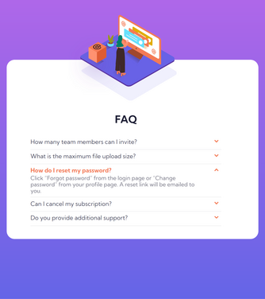

# FAQ accordion

## Table of contents

- [Overview](#overview)
  - [The challenge](#the-challenge)
  - [Screenshot](#screenshot)
  - [Links](#links)
- [My process](#my-process)
  - [Built with](#built-with)
- [Author](#author)

## Overview

### The challenge

Users should be able to:

- View the optimal layout for the component depending on their device's screen size
- See hover states for all interactive elements on the page
- Hide/Show the answer to a question when the question is clicked

### Screenshot

Desktop version:

Mobile version:

Landscape version:

### Links

- Production URL: [valentina-milicevic-prod-faq-accordion-card.vercel.app](http://valentina-milicevic-prod-faq-accordion-card.vercel.app)
- Development URL: [valentina-milicevic-dev-faq-accordion-card.vercel.app](http://valentina-milicevic-dev-faq-accordion-card.vercel.app)

## My process

### Built with

- Semantic HTML5 markup
- CSS custom properties
- Flexbox
- CSS Grid

## Author

- Website - [Valentina Milicevic](https://github.com/vanjamilicevic)
- Email: valentina.milicevic@quantoxtechnology.com